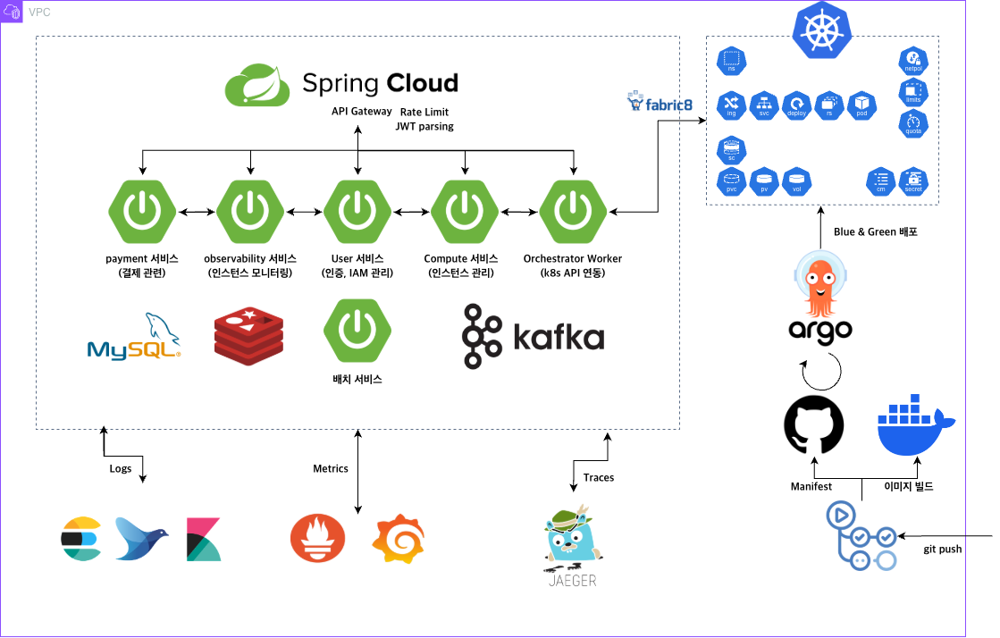
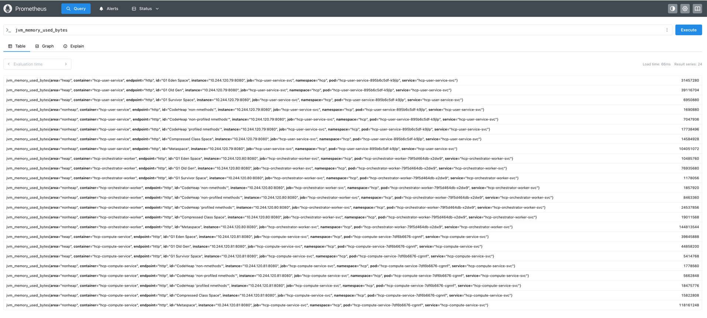
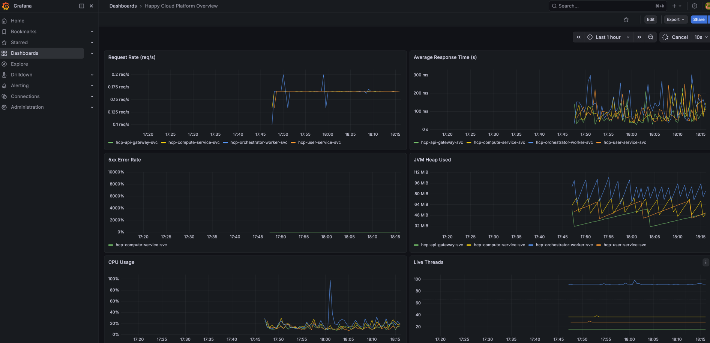
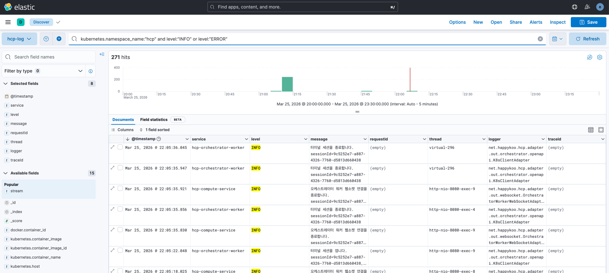

# Happy Cloud Platform Observability

<!-- prettier-ignore-start -->


## 해피 클라우드 플랫폼 아키텍처




### Metrics (Prometheus + Grafana)





* kube-prometheus-stack install

```
helm repo add prometheus-community https://prometheus-community.github.io/helm-charts
helm repo update
helm install monitoring prometheus-community/kube-prometheus-stack \
  -n monitoring --create-namespace \
  -f metrics/k8s/values-monitoring-lite.yaml
```

* grafana 비밀번호 확인 (ID: admin)

```
kubectl get secret monitoring-grafana -n monitoring \
  -o jsonpath="{.data.admin-password}" | base64 -d && echo
```

* service monitor 적용

```
$ kubectl apply -f metrics/k8s/user-service-monitor.yaml
$ kubectl apply -f metrics/k8s/compute-service-monitor.yaml
$ kubectl apply -f metrics/k8s/orchestrator-worker-monitor.yaml
$ kubectl apply -f metrics/k8s/api-gateway-monitor.yaml
```


### Logs



* json 로그 포맷

```
{
  "@timestamp": "2026-03-25T10:42:26.484490093Z",
  "service": "hcp-user-service",
  "level": "INFO",
  "logger": "net.happykoo.hcp.adapter.in.web.LoginController",
  "thread": "http-nio-8080-exec-7",
  "message": "액세스 토큰 재발급 요청을 수신했습니다.",
  "requestId": "c8c3f642-6707-4fef-91ea-26d86c3750ce",
  "traceId": "",
  "spanId": ""
}
```

* elasticsearch install

```
$ helm repo add elastic https://helm.elastic.co
$ helm repo update
$ helm install elasticsearch elastic/elasticsearch \
  --namespace logging --create-namespace \
  -f logs/elasticsearch/elastic-values.yaml
```

* elasticsearch 비밀번호 (ID: elastic)

```
kubectl get secrets --namespace=logging elasticsearch-master-credentials -ojsonpath='{.data.password}' | base64 -d
```

* 상태 확인

```
$ curl -k -u elastic:[key] https://127.0.0.1:9200
{
  "name" : "elasticsearch-master-0",
  "cluster_name" : "elasticsearch",
  "cluster_uuid" : "AUHXevKfSoajNTa-W4IEoQ",
  "version" : {
    "number" : "8.5.1",
    "build_flavor" : "default",
    "build_type" : "docker",
    "build_hash" : "c1310c45fc534583afe2c1c03046491efba2bba2",
    "build_date" : "2022-11-09T21:02:20.169855900Z",
    "build_snapshot" : false,
    "lucene_version" : "9.4.1",
    "minimum_wire_compatibility_version" : "7.17.0",
    "minimum_index_compatibility_version" : "7.0.0"
  },
  "tagline" : "You Know, for Search"
}
```

* elasticsearch token 생성

```
$ kubectl exec -it -n logging elasticsearch-master-0 -- \
bin/elasticsearch-service-tokens create elastic/kibana kibana-token
```

* kibana install

```
helm install kibana elastic/kibana \
  --namespace logging \
  -f logs/kibana/kibana-values.yaml
```

* fluentd install

```
$ helm repo add fluent https://fluent.github.io/helm-charts
$ helm repo update
$ helm upgrade --install fluentd fluent/fluentd \
  -n logging \
  -f logs/fluentd/fluentd-values.yaml
```


### Traces

